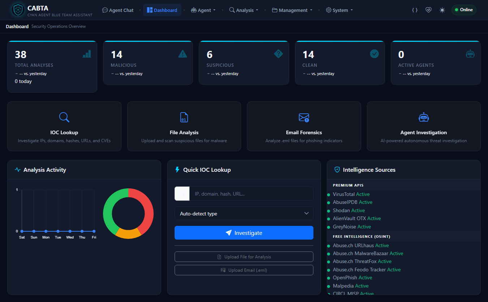
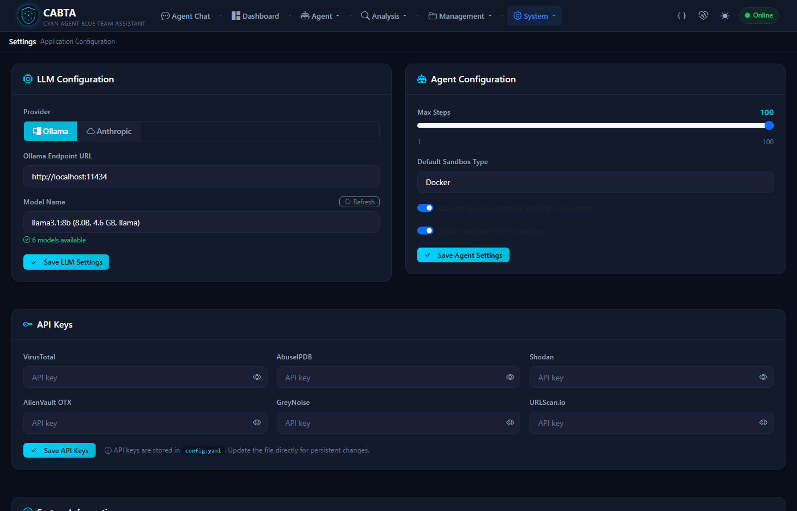
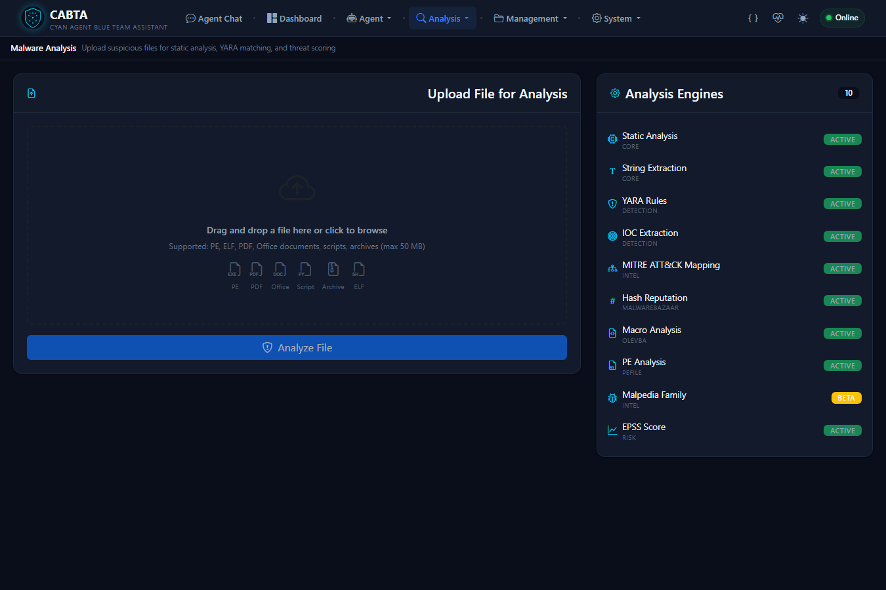
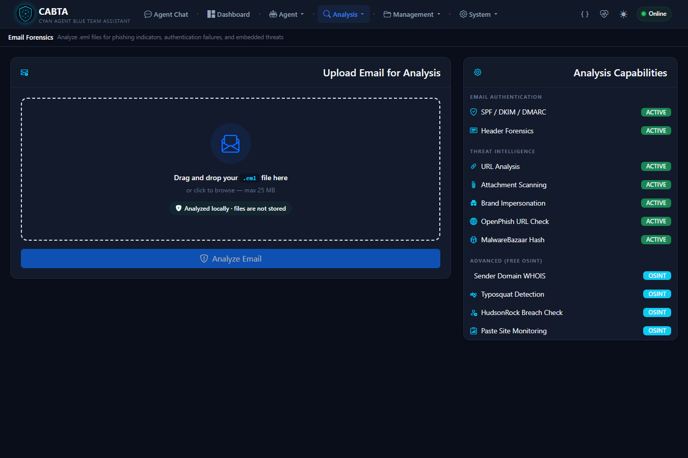
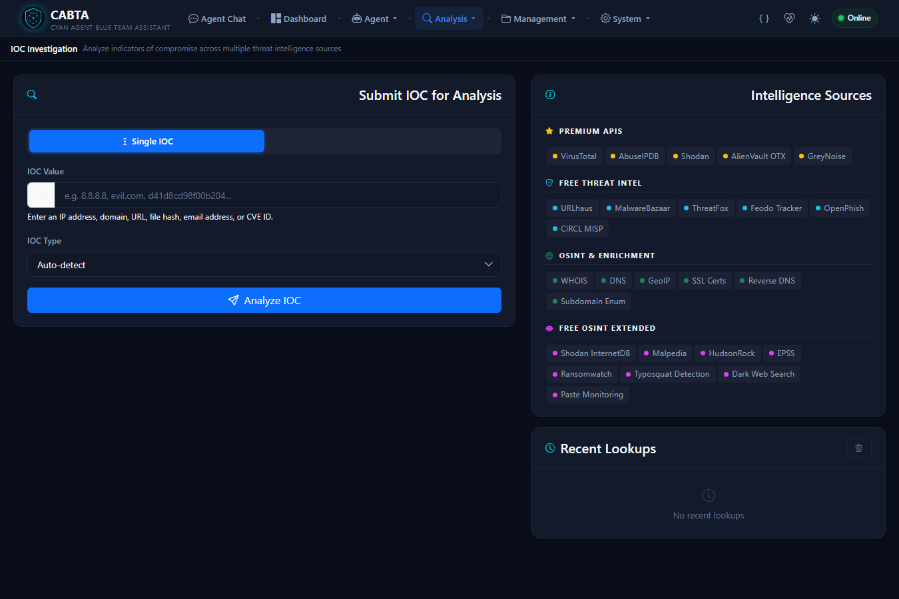
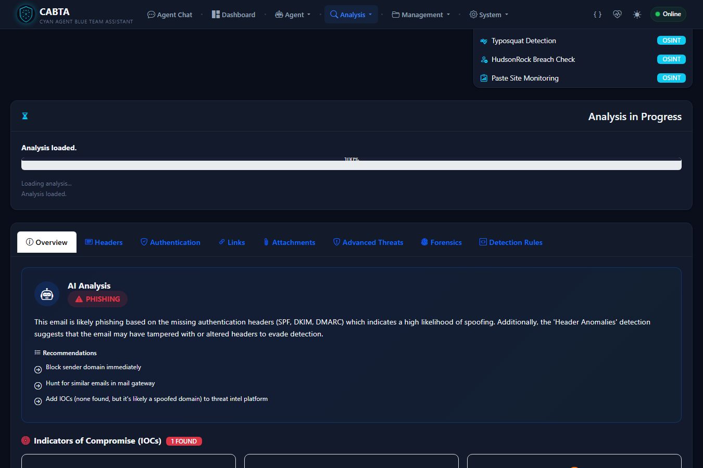

# CABTA - Cyan Agent Blue Team Assistant

AI-Powered SOC Platform for Threat Analysis, IOC Investigation & Email Forensics

[](https://www.python.org/downloads/)
[](LICENSE)
[](https://github.com/ugurrates/CABTA)

CABTA is a comprehensive, local-first security analysis platform designed for SOC analysts, incident responders, and threat hunters. It features a modern web dashboard, 20+ threat intelligence sources, advanced malware analysis, email forensics, and AI-powered investigation with local LLM support via Ollama.

---

## Screenshots

| Dashboard | Settings |
|:---------:|:--------:|
|  |  |

| File Analysis | Email Forensics |
|:------------:|:---------------:|
|  |  |

| IOC Investigation | Email Analysis Result |
|:-----------------:|:--------------------:|
|  |  |

---

## Features

### Core Platform

| Feature | Description |
|---------|-------------|
| **Web Dashboard** | Modern dark-themed SOC dashboard with real-time stats, charts, and quick actions |
| **Multi-Source Threat Intelligence** | 20+ integrated sources: VirusTotal, Shodan, AbuseIPDB, AlienVault OTX, GreyNoise, and 15 free OSINT feeds |
| **Advanced Malware Analysis** | PE/ELF/Mach-O/APK/Office/PDF/Script/Archive analysis with deep inspection |
| **Email Forensics** | SPF/DKIM/DMARC validation, BEC detection, phishing scoring, relay chain analysis |
| **IOC Investigation** | IP, domain, URL, hash, email, CVE lookup across all TI sources with DGA and domain age detection |
| **AI-Powered Analysis** | Local LLM via Ollama for threat summarization and context-aware verdicts |
| **Detection Rule Generation** | Auto-generated KQL, Splunk SPL, Sigma, YARA, Snort, FortiMail, Proofpoint, Mimecast rules |
| **Case Management** | Track investigations, link analyses, add notes |
| **STIX 2.1 Export** | Export IOCs as STIX bundles with TLP marking |

### v2.0 New Capabilities

| Feature | Description |
|---------|-------------|
| **Ransomware Detection** | Crypto constant scanning, ransom note detection, Bitcoin/Onion extraction, VSS deletion detection |
| **PE Deep Inspection** | TLS callbacks, PDB path analysis, Rich header validation, resource analysis, entry point anomalies |
| **Cobalt Strike Beacon Extraction** | XOR brute-force decryption, TLV config parsing, C2 server extraction |
| **Memory Forensics** | Volatility 3 integration for process analysis, code injection, network connections |
| **BEC Detection** | Business Email Compromise: urgency/financial/impersonation patterns, auth failure correlation |
| **Email Threat Indicators** | Tracking pixels, HTML forms, URL shorteners, data URIs, callback phishing (BazarCall) |
| **Text File Analysis** | C2 config detection, credential indicators, encoded content analysis |
| **Threat Actor Profiling** | 20 APT/cybercrime group database with MITRE technique matching |
| **APK Risk Scoring** | Dangerous permission mapping, suspicious API detection, obfuscation analysis, MITRE Mobile ATT&CK |
| **DGA Detection** | 7-heuristic algorithm: entropy, consonant ratio, bigram/trigram frequency, dictionary matching |
| **Domain Age Checking** | WHOIS-based newly registered domain detection with risk scoring |

### Key Differentiators

- **Zero Cloud Dependency**: All analysis runs locally with Ollama - no data leaves your network
- **Analyst-Grade Output**: Shows WHY something is malicious with detailed evidence and MITRE mapping
- **Production-Grade Scoring**: Multi-source weighted composite scoring with confidence levels
- **Real-Time Investigation**: Async operations for fast multi-source lookups
- **15 Free Intelligence Sources**: Works without any API keys using ArgusWatch OSINT feeds

---

## Architecture

```
+--------------------------------------------------------------------+
|                            CABTA v2.0                               |
+--------------------------------------------------------------------+
|                                                                      |
|  +------------------+  +------------------+  +------------------+    |
|  |   Web Dashboard  |  |    Agent Chat    |  |    REST API      |    |
|  |   (FastAPI +     |  |   (AI-powered    |  |   /api/analysis  |    |
|  |    Jinja2)       |  |    investigation)|  |   /api/reports   |    |
|  +--------+---------+  +--------+---------+  +--------+---------+    |
|           |                      |                      |            |
|           +----------------------+----------------------+            |
|                                  |                                   |
|  +---------------------------------------------------------------+  |
|  |                        TOOLS LAYER                             |  |
|  |  +--------------+ +--------------+ +------------------------+ |  |
|  |  |   Malware    | |    Email     | |   IOC Investigator     | |  |
|  |  |   Analyzer   | |   Analyzer   | | (IP/Domain/URL/Hash)   | |  |
|  |  +--------------+ +--------------+ +------------------------+ |  |
|  +---------------------------------------------------------------+  |
|                                  |                                   |
|  +---------------------------------------------------------------+  |
|  |                      ANALYZERS LAYER                           |  |
|  |  +------+ +------+ +------+ +------+ +------+ +------+       |  |
|  |  |  PE  | | ELF  | |Office| | PDF  | |Script| |  APK |       |  |
|  |  +------+ +------+ +------+ +------+ +------+ +------+       |  |
|  |  +------+ +------+ +------+ +------+ +------+ +------+       |  |
|  |  |Ransom| |Beacon| |Memory| | Text | |Archive| | BEC |       |  |
|  |  |ware  | |Config| |Foren.| |Analyz| |      | |Detect|       |  |
|  |  +------+ +------+ +------+ +------+ +------+ +------+       |  |
|  +---------------------------------------------------------------+  |
|                                  |                                   |
|  +---------------------------------------------------------------+  |
|  |                    INTEGRATIONS LAYER                          |  |
|  |  +-----------------+ +------------------+ +-----------------+ |  |
|  |  | Threat Intel    | |  LLM Analyzer    | | STIX Generator  | |  |
|  |  | (20+ sources)   | |  (Ollama/Cloud)  | | (STIX 2.1)      | |  |
|  |  +-----------------+ +------------------+ +-----------------+ |  |
|  |  +-----------------+ +------------------+ +-----------------+ |  |
|  |  | Threat Actor    | |  DGA Detector    | | Domain Age      | |  |
|  |  | Profiler (20grp)| |  (7 heuristics)  | | Checker (WHOIS) | |  |
|  |  +-----------------+ +------------------+ +-----------------+ |  |
|  +---------------------------------------------------------------+  |
|                                  |                                   |
|  +---------------------------------------------------------------+  |
|  |                      SCORING & OUTPUT                          |  |
|  |  +-----------+ +----------+ +-------+ +-------+ +-----------+ |  |
|  |  | Adaptive  | | Tool-    | | HTML  | | MITRE | | Detection | |  |
|  |  | Scoring   | | Based    | |Report | | Nav.  | | Rules     | |  |
|  |  | Engine    | | Scoring  | |       | |       | | Generator | |  |
|  |  +-----------+ +----------+ +-------+ +-------+ +-----------+ |  |
|  +---------------------------------------------------------------+  |
+----------------------------------------------------------------------+
```

---

## Quick Start

### Prerequisites

- Python 3.10+
- Ollama (optional, for AI analysis)

### Installation

```bash
# Clone repository
git clone https://github.com/ugurrates/CABTA.git
cd CABTA

# Create virtual environment
python -m venv venv
source venv/bin/activate    # Linux/Mac
# or
.\venv\Scripts\activate     # Windows

# Install dependencies
pip install -r requirements.txt

# Copy and configure
cp config.yaml.example config.yaml
# Edit config.yaml with your API keys (optional - works without them)

# Verify installation
python test_setup.py
```

### Start the Web Dashboard

```bash
python -m uvicorn src.web.app:create_app --factory --host 0.0.0.0 --port 3003
```

Open http://localhost:3003 in your browser.

### Ollama Setup (Optional)

```bash
# Install Ollama
curl -fsSL https://ollama.com/install.sh | sh   # Linux
# or download from https://ollama.com for Windows/Mac

# Pull recommended model
ollama pull llama3.1:8b

# Verify
ollama list
```

---

## Configuration

Edit `config.yaml` with your settings:

```yaml
# API Keys (all optional - 15 free sources work without keys)
api_keys:
  virustotal: "your-vt-api-key"
  abuseipdb: "your-abuseipdb-key"
  shodan: "your-shodan-key"
  alienvault: "your-otx-key"

# LLM Configuration
llm:
  provider: "ollama"           # ollama, openai, anthropic
  ollama_model: "llama3.1:8b"
  ollama_endpoint: "http://localhost:11434"
```

### API Key Sources

| Source | Free Tier | URL |
|--------|-----------|-----|
| VirusTotal | 500 req/day | https://www.virustotal.com/gui/join-us |
| AbuseIPDB | 1000 req/day | https://www.abuseipdb.com/register |
| Shodan | 100 req/month | https://account.shodan.io/register |
| AlienVault OTX | Unlimited | https://otx.alienvault.com/accounts/signup |
| GreyNoise | 50 req/day | https://viz.greynoise.io/signup |

### Free Sources (No API Key Required)

These 15 OSINT sources work out of the box:

| Source | Type |
|--------|------|
| Abuse.ch URLhaus | Malicious URLs |
| Abuse.ch MalwareBazaar | Malware samples |
| Abuse.ch ThreatFox | IOC sharing |
| Abuse.ch Feodo Tracker | Botnet C2 |
| OpenPhish | Phishing URLs |
| Malpedia | Malware families |
| CIRCL MISP | Threat sharing |
| HudsonRock | Breach data |
| Shodan InternetDB | Passive recon |
| Ransomwatch | Ransomware groups |
| EPSS | Exploit prediction |
| IPinfo (lite) | IP geolocation |
| RDAP | Domain registration |
| BGPView | ASN/prefix data |
| Google Safe Browsing | URL reputation |

---

## Analysis Modules

### File Analysis

Supports **15+ file types** with specialized analyzers:

| Analyzer | File Types | Capabilities |
|----------|-----------|--------------|
| **PE Analyzer** | .exe, .dll, .sys | Imports, sections, entropy, packer detection, TLS callbacks, PDB path, Rich header, resource analysis, manifest UAC check |
| **Ransomware Analyzer** | Any PE | Crypto constants, ransom notes, Bitcoin/Onion extraction, VSS deletion, family detection |
| **Beacon Config Extractor** | Any PE | Cobalt Strike beacon XOR decryption, TLV config parsing, C2/port/watermark extraction |
| **ELF Analyzer** | Linux binaries | Symbols, sections, capabilities |
| **Mach-O Analyzer** | macOS binaries | Universal binaries, entitlements |
| **APK Analyzer** | Android apps | Permissions, APIs, risk scoring, obfuscation, MITRE Mobile ATT&CK |
| **Office Analyzer** | .docx, .xlsx, .pptx | Macros (VBA), OLE objects, DDE links |
| **PDF Analyzer** | .pdf | JavaScript, launch actions, embedded files |
| **Script Analyzer** | .ps1, .bat, .vbs, .js | De-obfuscation (PowerShell, JavaScript, VBScript, Batch) |
| **Text Analyzer** | .txt, .log, .csv, .conf | C2 patterns, IOC extraction, credential indicators |
| **Archive Analyzer** | .zip, .rar, .7z, .tar | Nested extraction, path traversal detection |
| **Memory Analyzer** | .dmp, .raw, .vmem | Volatility 3 integration, process analysis, code injection |

### Email Forensics

Comprehensive email security analysis:

- **Authentication**: SPF, DKIM, DMARC, ARC validation with scoring
- **BEC Detection**: Urgency patterns, financial fraud, executive impersonation, reply-to mismatch, auth failures
- **Phishing Analysis**: URL chain analysis, brand impersonation, lookalike domains, typosquatting
- **Threat Indicators**: Tracking pixels, HTML forms, URL shorteners, data URIs, JavaScript, callback phishing
- **DFIR Forensics**: Relay chain analysis, hop timing, infrastructure profiling, sender reputation
- **Attachments**: Malware scanning, double extension detection, embedded content analysis
- **Detection Rules**: Auto-generated KQL, Splunk SPL, Sigma, FortiMail, Proofpoint, Mimecast, M365

### IOC Investigation

Multi-source investigation for any indicator type:

- **Supported Types**: IPv4/IPv6, domains, URLs, file hashes (MD5/SHA1/SHA256), email addresses, CVE IDs
- **Intelligence Sources**: 20+ sources queried in parallel with async operations
- **Enrichment**: DGA detection (7 heuristics), domain age checking (WHOIS), threat actor profiling
- **STIX Export**: One-click export to STIX 2.1 bundles with TLP marking
- **Scoring**: Source-weighted confidence scoring with kill-chain detection

---

## Scoring System

CABTA uses a multi-layered scoring architecture:

| Layer | Purpose | Weight |
|-------|---------|--------|
| **Tool-Based Scoring** | Aggregates scores from individual analysis tools | Primary |
| **Intelligent Scoring** | Source-weighted IOC confidence with freshness decay | IOC-specific |
| **Adaptive Scoring** | Kill-chain stage detection, combo patterns, temporal analysis | Overlay |
| **Enhanced Scoring** | BEC, ransomware, and deep inspection score integration | Domain-specific |
| **False Positive Filter** | Filters CA domains, version strings, internal ranges | Final pass |

### Verdicts

| Score | Verdict | Description |
|-------|---------|-------------|
| 70-100 | **MALICIOUS** | High confidence threat |
| 40-69 | **SUSPICIOUS** | Requires investigation |
| 1-39 | **CLEAN** | Low risk |
| 0 | **UNKNOWN** | Insufficient data |
| N/A | **SPAM** | Unsolicited but not malicious |
| N/A | **RANSOMWARE** | Ransomware-specific verdict |

---

## Threat Intelligence Sources

### Premium (API Key Required)

| Source | Capabilities |
|--------|-------------|
| **VirusTotal** | File/URL/Domain/IP scanning, detection ratios, behavioral analysis |
| **AbuseIPDB** | IP reputation, abuse reports, confidence scoring |
| **Shodan** | Port scanning, service detection, vulnerability assessment |
| **AlienVault OTX** | Pulse-based threat intelligence, IOC correlation |
| **GreyNoise** | Internet scanner identification, benign/malicious classification |

### Free (ArgusWatch - No Key Required)

15 sources including Abuse.ch feeds, OpenPhish, Malpedia, CIRCL MISP, HudsonRock, Ransomwatch, EPSS, and more.

---

## Detection Rule Generation

CABTA auto-generates detection rules in **7 SIEM/tool formats**:

| Format | Target |
|--------|--------|
| **KQL** | Microsoft Defender / Sentinel |
| **Splunk SPL** | Splunk SIEM |
| **Sigma** | Universal SIEM format |
| **YARA** | File-based detection |
| **FortiMail** | Fortinet email gateway |
| **Proofpoint** | Proofpoint email security |
| **Mimecast** | Mimecast email security |

Rules include sender-based, URL-based, attachment-based, and behavioral detections with proper metadata (author, date, severity, MITRE mapping).

---

## Project Structure

```
CABTA/
|-- src/
|   |-- analyzers/           # File type analyzers
|   |   |-- pe_analyzer.py          # PE analysis + deep inspection
|   |   |-- ransomware_analyzer.py  # Ransomware detection
|   |   |-- beacon_config_extractor.py  # Cobalt Strike beacon extraction
|   |   |-- memory_analyzer.py      # Volatility 3 memory forensics
|   |   |-- bec_detector.py         # Business Email Compromise detection
|   |   |-- email_threat_indicators.py  # 10 email threat checks
|   |   |-- text_analyzer.py        # C2/IOC text file analysis
|   |   |-- apk_analyzer.py         # Android APK risk scoring
|   |   |-- file_type_router.py     # Magic bytes + MIME routing
|   |   +-- ...                     # ELF, Mach-O, Office, PDF, Script, Archive
|   |-- integrations/        # External service integrations
|   |   |-- llm_analyzer.py         # Ollama/Anthropic LLM analysis
|   |   |-- threat_actor_profiler.py # 20 APT group database
|   |   |-- stix_generator.py       # STIX 2.1 indicator export
|   |   +-- threat_intel.py         # 20+ TI source clients
|   |-- scoring/              # Multi-layered scoring engine
|   |   |-- tool_based_scoring.py    # Per-tool weighted scoring
|   |   |-- intelligent_scoring.py   # Source-weighted IOC scoring
|   |   |-- adaptive_scoring.py      # Kill-chain & combo detection
|   |   +-- enhanced_scoring.py      # BEC/ransomware scoring
|   |-- detection/            # Detection rule generation
|   |   |-- rule_generator.py        # KQL, Sigma, YARA, Snort
|   |   +-- llm_rule_generator.py    # LLM-assisted rule generation
|   |-- tools/                # High-level analysis tools
|   |   |-- malware_analyzer.py      # File analysis pipeline
|   |   |-- email_analyzer.py        # Email analysis pipeline
|   |   +-- ioc_investigator.py      # IOC investigation pipeline
|   |-- utils/                # Utilities
|   |   |-- dga_detector.py          # 7-heuristic DGA detection
|   |   |-- domain_age_checker.py    # WHOIS domain age checking
|   |   +-- entropy_analyzer.py      # Shannon entropy analysis
|   |-- web/                  # FastAPI web application
|   |   |-- app.py                   # Application factory
|   |   +-- routes/                  # API & page routes
|   |-- reporting/            # Report generation
|   +-- mcp_servers/          # MCP tool servers
|-- templates/                # Jinja2 HTML templates
|-- static/                   # CSS, JS, images
|-- data/                     # Playbooks, YARA rules, hash DB
|-- examples/                 # Sample test files
|-- tests/                    # Test suite
|-- config.yaml.example       # Configuration template
+-- requirements.txt          # Python dependencies
```

---

## API Reference

### Analysis Endpoints

| Method | Endpoint | Description |
|--------|----------|-------------|
| POST | `/api/analysis/ioc` | Submit IOC for investigation |
| POST | `/api/analysis/file` | Upload file for malware analysis |
| POST | `/api/analysis/email` | Upload .eml for email forensics |
| GET | `/api/analysis/{id}` | Get analysis results |
| GET | `/api/analysis/{id}/status` | Check analysis progress |
| GET | `/api/analysis/history/` | List all analyses |

### Report Endpoints

| Method | Endpoint | Description |
|--------|----------|-------------|
| GET | `/api/reports/{id}/json` | JSON report |
| GET | `/api/reports/{id}/html` | HTML report |
| GET | `/api/reports/{id}/mitre` | MITRE ATT&CK Navigator layer |

### Dashboard & Config

| Method | Endpoint | Description |
|--------|----------|-------------|
| GET | `/api/dashboard/stats` | Dashboard statistics |
| GET | `/api/config/health` | System health check |
| GET | `/api/config/tools` | Available analysis tools |
| GET/POST | `/api/config/settings` | Application settings |

Full API documentation available at http://localhost:3003/api/docs (Swagger UI).

---

## Examples

The `examples/` directory contains synthetic test files:

| File | Expected Result |
|------|----------------|
| `sample_c2_config.txt` | MALICIOUS (90-100) - C2 patterns, persistence, lateral movement |
| `sample_ioc_list.txt` | Mixed - IOCs for bulk investigation |

```bash
# Test file analysis with a C2 config
curl -X POST http://localhost:3003/api/analysis/file -F "file=@examples/sample_c2_config.txt"

# Test IOC investigation
curl -X POST http://localhost:3003/api/analysis/ioc -H "Content-Type: application/json" -d '{"value": "203.0.113.50"}'
```

---

## MCP Server Integration

CABTA can run as an MCP (Model Context Protocol) server for integration with MCP-compatible clients:

```json
{
  "mcpServers": {
    "cabta-remnux": {
      "command": "python",
      "args": ["-m", "src.mcp_servers.remnux_tools"],
      "cwd": "/path/to/CABTA"
    }
  }
}
```

Available MCP servers: `remnux_tools`, `flare_tools`, `forensics_tools`, `threat_intel_tools`, `osint_tools`, `network_tools`, `vulnerability_tools`.

---

## Contributing

1. Fork the repository
2. Create your feature branch (`git checkout -b feature/amazing-feature`)
3. Commit changes (`git commit -m 'Add amazing feature'`)
4. Push to branch (`git push origin feature/amazing-feature`)
5. Open a Pull Request

### Development Setup

```bash
git clone https://github.com/ugurrates/CABTA.git
cd CABTA
pip install -r requirements.txt
pip install pytest black flake8
pytest
```

---

## License

This project is licensed under the MIT License - see the [LICENSE](LICENSE) file for details.

---

## Author

**Ugur Ates**
- GitHub: [@ugurrates](https://github.com/ugurrates)
- Medium: [@ugur.can.ates](https://medium.com/@ugur.can.ates)
- LinkedIn: [Ugur Ates](https://www.linkedin.com/in/ugurcanates/)

---

## Acknowledgments

- [MITRE ATT&CK](https://attack.mitre.org/) for the threat framework
- [VirusTotal](https://www.virustotal.com/) for threat intelligence
- [Ollama](https://ollama.com/) for local LLM support
- [Mandiant FLARE](https://github.com/mandiant) for capa and FLOSS
- [Abuse.ch](https://abuse.ch/) for free threat intelligence feeds

---

## Disclaimer

This tool is intended for authorized security testing and research only. Users are responsible for ensuring they have proper authorization before analyzing any files or investigating any indicators. The author is not responsible for any misuse of this tool.
